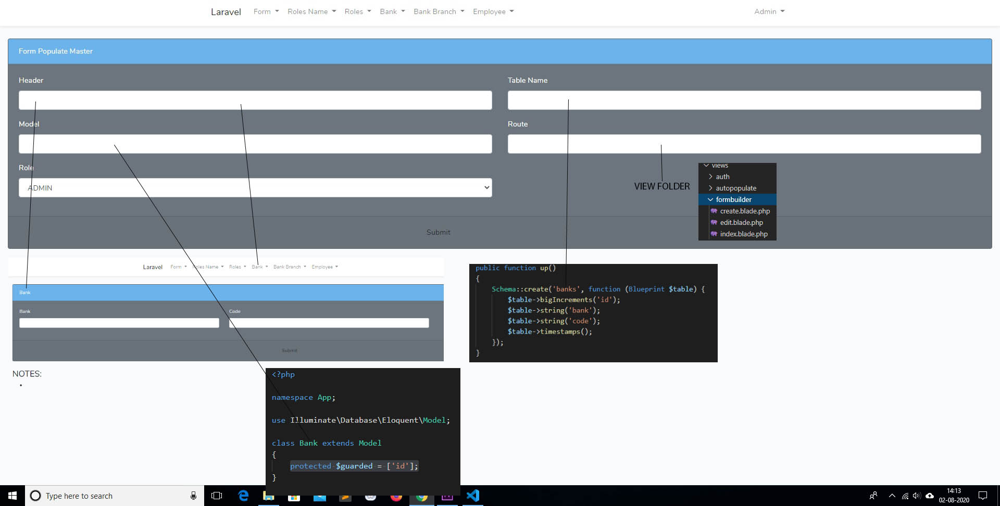

<h2>FormPopulate</h2>
With the help of FormPopulate you can create form in less than a minute.  
FormPopulate will:
<ul>
    <li>Autopopulate Form from database</li>
    <li>Auto Populate select option</li>
    <li>Add class and attribute to form element</li>
</ul>
<h2>Documentation</h2>
FormPopulate make use of getColumnListing(string $table) for listing column of a given table. 
<h3>Installation</h3>
<ul>
    <li>Clone it from https://github.com/Dapborlang/FormPopulate.git and use composer update to finish the installation. </li>
    <li>Run php artisan migrate and serve the application for testing</li>
    <li>Default User: admin@domain.com and Password: password</li>
</ul>    
<h3>Creating Forms</h3>
<ul>
    <li>First you need create Model and migration.</li>
    <li>
    <pre>public function up()
    {
        Schema::create('banks', function (Blueprint $table) {
            $table->bigIncrements('id');
            $table->string('bank');
            $table->string('code');
            $table->timestamps();
        });
    }</pre></li>
    <li>Goto Form and then Create.</li>
    <li>Fill the required fields as shown belown</li>
</ul>

<ul>
    <li>In this case, fill Header="Bank", Table Name="banks", Model="Bank", Route="formbuilder" and Role="Admin" (You can add many user's Role) and Submit</li>
</ul>
You will be redirect to another form for filling more details as shown below.

<ul>
    <li>In this case, select Form Populate Id="Bank", Exclude="id,updated_at,created_at", Attributes="{"bank":"required","code":"required"}". Leave blank all other fields and press Submit</li>
    <li>Remember to specify the guarded attribute on the model</li>
</ul>
<h4>Hurray! The CRUD operation for Bank is ready</h4>

<h3>Creating Forms With Select Option</h3>

<ul>
    <li>Create Model with migration that belongsTo the first Model and follow the same procedure in the Form\Create page</li>
    <li>
<pre>class BankBranch extends Model
{
    protected $guarded = ['id'];

    public function Bank()
    {
       return $this->belongsTo('App\Bank','bank_id');
    }
}</pre>
<pre>
    public function up()
    {
        Schema::create('bank_branches', function (Blueprint $table) {
            $table->bigIncrements('id');
            $table->unsignedBigInteger('bank_id');
            $table->string('branch');
            $table->string('ifsc');
            $table->text('address');
            $table->foreign('bank_id')->references('id')->on('banks');
            $table->timestamps();
        });
    }</pre>
</li>
    <li>To populate Select Option, fill the "Foreign Keys" field as shown in the placeholder. 
    <pre>{
	"Model_to_fetch": [
		"foreign_key",
		"master_primary_id",
		"master_description_column"
	]
}</pre></li> 
    <li>In this case, Model_to_fetch is the Bank model as want to get all the banks, foreign_key="bank_id", master_primary_id="id" and master_description_column="bank"<li>
    <li>In Type, fill the type of input eg "date","text" etc. and submit.</li>
</ul>

https://youtu.be/uK1WyB6rO1o
